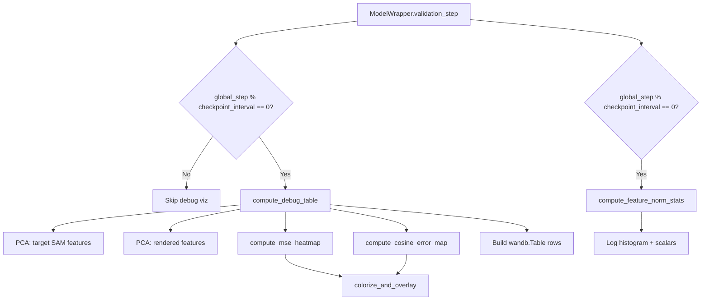

# Design Document: Wandb Debug Visualizations

## Overview

This feature adds a debug visualization module that logs structured diagnostic artifacts to Weights & Biases during validation. At checkpoint frequency, it produces a `wandb.Table` with per-example columns (target RGB, PCA visualizations of target SAM and rendered features, MSE heatmap overlay, cosine error overlay) and a separate feature norm histogram with scalar statistics.

The design places all visualization logic in a standalone module (`src/model/debug_visualizer.py`) that is called from the existing `validation_step`. This keeps the validation loop clean and makes the visualization logic independently testable. The checkpoint interval is read from the global config via `get_cfg()["checkpointing"]["every_n_train_steps"]`, matching the existing pattern used elsewhere in `ModelWrapper`.

## Architecture



The debug visualizer is a collection of pure functions (no class state needed). The orchestration function `log_debug_visualizations` is called at the end of `validation_step` and handles the frequency gating internally.

## Components and Interfaces

### Module: `src/model/debug_visualizer.py`

Public functions:

```python
def log_debug_visualizations(logger, global_step, checkpoint_interval,
                             target_rgb, target_sam_feature, rendered_feature, img_size):
    """Top-level entry point called from validation_step."""

def compute_mse_heatmap(rendered_feature, target_feature):
    """Compute per-pixel MSE across channels, returns (H, W) tensor."""

def compute_cosine_error_map(rendered_feature, target_feature):
    """Compute 1 - cosine_similarity per pixel, returns (H, W) tensor."""

def colorize_heatmap(heatmap, vmin=0.0, vmax=None):
    """Apply perceptually uniform colormap (viridis) to a single-channel map, returns (3, H, W)."""

def alpha_blend(overlay, background, alpha=0.5):
    """Blend overlay onto background, both (3, H, W) in [0,1], returns (3, H, W)."""

def compute_feature_norms(feature):
    """Compute per-spatial-position L2 norms, returns flat vector of length H*W."""
```

### Integration in `ModelWrapper.validation_step`

At the end of the existing feature rendering visualization block (after the PCA comparison logging), add a call to `log_debug_visualizations`. The function receives:

- `self.logger` (WandbLogger)
- `self.global_step`
- `get_cfg()["checkpointing"]["every_n_train_steps"]` for the interval
- The target RGB image tensor (already available as `batch["target"]["image"][0]`)
- The target SAM feature (from `foundation_feature[:, CV:]` for target views)
- The rendered feature (from `gaussian_feature` for target views)
- `(H, W)` target image size

The function gates on `global_step % checkpoint_interval == 0` and returns early otherwise, avoiding any computation on non-checkpoint steps.

### Accessing Checkpoint Interval

The existing `get_cfg()` pattern (already imported in `model_wrapper.py`) provides access to the full OmegaConf config dict. The checkpoint interval is at `get_cfg()["checkpointing"]["every_n_train_steps"]`. This avoids threading a new parameter through the constructor.

### Heatmap Colorization

Uses `matplotlib.cm.get_cmap("viridis")` via the existing `apply_color_map_to_image` utility in `src/visualization/color_map.py`. The heatmap is normalized to [0, 1] before colorization (dividing by `vmax` which defaults to the map's own max value).

### Alpha Blending

Simple formula: `result = alpha * overlay + (1 - alpha) * background` with `alpha=0.5`. Both inputs must be (3, H, W) tensors in [0, 1]. The target RGB is obtained via `inverse_normalize` (converts from [-1, 1] to [0, 1]).

### Wandb Table Construction

```python
table = wandb.Table(columns=["target_rgb", "target_sam_pca", "rendered_feature_pca",
                              "mse_heatmap_overlay", "cosine_error_overlay"])
```

Each row corresponds to one validation example. Images are converted to numpy HWC uint8 format before wrapping in `wandb.Image`.

### Feature Norm Histogram

For each validation batch at checkpoint frequency:

1. Compute `target_norms = target_feature.norm(dim=0).flatten()` → vector of length 4096
2. Compute `rendered_norms = rendered_feature.norm(dim=0).flatten()` → vector of length 4096
3. Log `wandb.Histogram` for both distributions under `"val/feature_norm_histogram"`
4. Log scalar metrics (min, max, std) for each

## Data Models

### Input Tensors

| Tensor | Shape | Range | Source |
|--------|-------|-------|--------|
| target_rgb | (V, 3, H, W) | [-1, 1] | `batch["target"]["image"][0]` |
| target_sam_feature | (V, 256, 64, 64) | unbounded | `forward_foundation_model` output |
| rendered_feature | (V, 256, H, W) | unbounded | `output.feature[0]` after interpolation to (64, 64) |

### Intermediate Tensors

| Tensor | Shape | Range |
|--------|-------|-------|
| mse_heatmap | (64, 64) | [0, ∞) |
| cosine_error_map | (64, 64) | [0, 2] |
| colorized_heatmap | (3, H, W) | [0, 1] |
| blended_overlay | (3, H, W) | [0, 1] |
| feature_norms | (4096,) | [0, ∞) |

## Correctness Properties

*A property is a characteristic or behavior that should hold true across all valid executions of a system — essentially, a formal statement about what the system should do. Properties serve as the bridge between human-readable specifications and machine-verifiable correctness guarantees.*

### Property 1: PCA output validity

*For any* feature tensor of shape (1, C, H, W) where C > 3, running PCA and resizing to target dimensions (tH, tW) SHALL produce an output of shape (1, 3, tH, tW) with all values in [0, 1].

**Validates: Requirements 3.1, 3.2, 4.1, 4.2**

### Property 2: MSE heatmap non-negativity and shape

*For any* two feature tensors of shape (C, H, W), the MSE heatmap computed as `((a - b) ** 2).mean(dim=0)` SHALL produce a tensor of shape (H, W) with all values >= 0.

**Validates: Requirements 5.1**

### Property 3: Cosine error map range and shape

*For any* two non-zero feature tensors of shape (C, H, W), the cosine error map (1 minus cosine similarity after L2 normalization) SHALL produce a tensor of shape (H, W) with all values in [0, 2].

**Validates: Requirements 6.1, 6.2, 6.3**

### Property 4: Colormap produces valid 3-channel RGB

*For any* single-channel tensor of shape (H, W) with values in [0, 1], applying the colormap SHALL produce a tensor of shape (3, H, W) with all values in [0, 1].

**Validates: Requirements 5.3, 6.5**

### Property 5: Alpha blend preserves value range

*For any* two tensors of shape (3, H, W) with values in [0, 1] and any alpha in [0, 1], the alpha-blended result SHALL have shape (3, H, W) with all values in [0, 1].

**Validates: Requirements 5.4, 6.6**

### Property 6: Feature norm statistics consistency

*For any* feature tensor of shape (C, H, W) with at least one non-zero spatial position, the computed L2 norms SHALL all be non-negative, and the scalar statistics SHALL satisfy min <= max and std >= 0.

**Validates: Requirements 7.1, 7.3**

### Property 7: Checkpoint frequency gating

*For any* positive checkpoint_interval and any non-negative global_step, the debug visualizer SHALL log if and only if `global_step % checkpoint_interval == 0`.

**Validates: Requirements 8.2, 8.3**

## Error Handling

- **SVD failure in PCA**: The existing `run_pca` already catches exceptions and returns a zero tensor. The debug visualizer reuses this behavior — a failed PCA produces a black image rather than crashing the training run.
- **Rendered feature is None**: When no feature head is configured, `output.feature` is None. The visualizer checks this at entry and returns immediately without logging.
- **Zero-norm features**: When computing cosine similarity, features with zero norm at a spatial position would produce NaN. The implementation adds a small epsilon (1e-8) to the norm before division, clamping the cosine error to [0, 2].
- **Wandb logger unavailable**: If `logger` is not a `WandbLogger` (e.g., during local debugging with `LocalLogger`), the function returns early. This is checked via `isinstance(logger, WandbLogger)`.

## Testing Strategy

### Property-Based Tests (Hypothesis)

The pure computation functions (`compute_mse_heatmap`, `compute_cosine_error_map`, `colorize_heatmap`, `alpha_blend`, `compute_feature_norms`) are tested with property-based tests using the **Hypothesis** library with `hypothesis[numpy]` for tensor generation.

- Minimum 100 iterations per property test
- Each test tagged with: **Feature: wandb-debug-visualizations, Property {N}: {title}**
- Generators produce random float tensors of valid shapes and ranges
- Tests verify shape invariants, value range invariants, and mathematical properties

### Unit Tests (Example-Based)

- Table schema verification: assert column names match spec (Req 1.2)
- None-feature skip: pass None rendered feature, verify no logging (Req 1.3)
- End-to-end integration: mock `WandbLogger`, run `log_debug_visualizations` with synthetic data, verify `log_image` / `log` calls (Req 2.1, 3.3, 4.3, 5.5, 6.7, 7.2)
- Config access: verify `get_cfg()["checkpointing"]["every_n_train_steps"]` returns expected int (Req 8.1)

### Test Location

Tests live in `tests/test_debug_visualizer.py`, using `pytest` + `hypothesis`.
