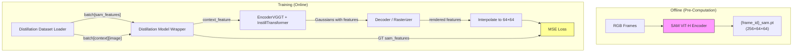

# Design Document: Pre-Computed SAM Distillation Pipeline

## Overview

This design describes a standalone training pipeline that distills SAM ViT-H encoder features into the C3G model's InstillTransformer without running the SAM encoder at training time. The pipeline consists of four new components:

1. **Pre-computation script** — runs SAM encoder offline on all training frames, saving 256×64×64 feature maps as `.pt` files alongside existing frame data.
2. **Distillation dataset loaders** (Replica + ScanNet) — new IterableDataset classes that load pre-computed SAM features from disk instead of raw SAM-resolution images.
3. **Distillation model wrapper** — a new LightningModule that computes MSE loss between rendered Gaussian features and ground-truth SAM features, with no SAM model loaded.
4. **Training config** — a Hydra YAML that wires the new components together.

The existing live-SAM pipeline (`model_wrapper.py`, `dataset_scannet_2dseg.py`, `dataset_replica_2dseg.py`, `feature_head_sam.yaml`) remains completely untouched.

### Design Rationale

- **Separation over modification**: Each new component is a standalone file. This avoids conditional branches in existing code and makes the two pipelines independently testable.
- **MSE over cosine similarity**: The existing pipeline uses cosine similarity + prompted segmentation loss. The new pipeline uses direct MSE on the raw feature maps, which is simpler, provides stronger gradient signal for feature magnitude, and removes the need for a SAM decoder at training time.
- **Geometry detachment**: Gaussian positions/covariances are detached before feature rendering so only the feature stream (to_anotherv, to_yout, ff2, feature_gmae_to_gaussians) receives gradients.

## Architecture



### Data Flow

1. **Pre-computation**: For each frame, load RGB → resize to 1024×1024 → SAM pixel normalization → SAM ViT-H encoder → save (256, 64, 64) float32 tensor.
2. **Dataset loading**: Load `{frame_id}_sam.pt` for each view, stack into `(V, 256, 64, 64)` tensors under `batch["context"]["sam_features"]` and `batch["target"]["sam_features"]`.
3. **Forward pass**: Context SAM features are reshaped to `(B, V*H*W, C)` = `(B, V*64*64, 256)` and passed as `context_feature` (the `y` input) to InstillTransformer. The transformer produces per-Gaussian feature vectors via `feature_gmae_to_gaussians`.
4. **Rendering**: The decoder rasterizes Gaussian features into 2D feature maps at target viewpoints. Geometry is detached.
5. **Loss**: Rendered features are bilinearly interpolated to 64×64, then MSE is computed against the target-view SAM features from the batch.

## Components and Interfaces

### 1. Pre-Computation Script (`scripts/precompute_sam_features.py`)

```python
def main(
    dataset_root: Path,
    dataset: Literal["replica", "scannet"],
    scenes: list[str],
    sam_checkpoint: str,
    sam_model_variant: str = "sam_vit_h",
    batch_size: int = 8,
    overwrite: bool = False,
) -> None:
    """Iterate all frames, encode with SAM, save .pt files."""
```

**Interface**:
- Input: CLI args (dataset root, scene list, SAM checkpoint path, batch size, overwrite flag)
- Output: `{frame_id}_sam.pt` files written to disk

**Key behaviors**:
- Uses `src.model.sam.loader.load_sam` to load the frozen SAM model
- Uses `src.model.sam.preprocess.resize_images_longest_side` and `preprocess_images` for normalization
- Processes frames in batches of configurable size
- Skips existing `.pt` files unless `--overwrite` is set
- Logs warnings and continues on unreadable frames

### 2. Distillation Dataset — Replica (`src/dataset/dataset_replica_distill.py`)

```python
class DatasetReplicaDistill(IterableDataset):
    """Replica loader that yields pre-computed SAM features alongside images."""

    def __iter__(self) -> Iterator[dict]:
        # Yields: {
        #   "context": { "image", "extrinsics", "intrinsics", "sam_features", ... },
        #   "target":  { "image", "extrinsics", "intrinsics", "sam_features", ... },
        #   "scene": str,
        # }
```

**Key differences from `DatasetReplica2dSeg`**:
- Loads `{frame_id}_sam.pt` instead of `{frame_id}_y.png` (no label maps needed)
- Produces `sam_features` key (V, 256, 64, 64) instead of `label` key
- Does NOT produce `sam_image` (no live SAM input)
- Skips samples where any `_sam.pt` file is missing

### 3. Distillation Dataset — ScanNet (`src/dataset/dataset_scannet_distill.py`)

```python
class DatasetScannetDistill(IterableDataset):
    """ScanNet loader that yields pre-computed SAM features alongside images."""
```

**Same pattern as Replica distillation loader**, with ScanNet-specific:
- Scene discovery and train/val/test splitting (reuses `scannet_2dseg_splits`)
- Multiple target views per sample (reuses view sampler logic)
- No `sam_image` field, no `label` field

### 4. Distillation Model Wrapper (`src/model/distillation_wrapper.py`)

```python
class DistillationModelWrapper(LightningModule):
    """Training loop for MSE feature distillation (no SAM at training time)."""

    def __init__(
        self,
        optimizer_cfg: OptimizerCfg,
        train_cfg: DistillTrainCfg,
        encoder: EncoderVGGT,
        decoder: Decoder,
        losses: list[Loss],  # RGB losses (MSE, LPIPS)
        step_tracker: StepTracker | None,
    ) -> None: ...

    def training_step(self, batch, batch_idx) -> Tensor:
        # 1. Extract context SAM features from batch
        # 2. Reshape to (B, V*64*64, 256) for InstillTransformer
        # 3. Forward encoder (produces Gaussians with features)
        # 4. Detach geometry, render features
        # 5. Interpolate rendered features to 64×64
        # 6. Compute MSE against target SAM features
        # 7. Compute RGB losses (optional, for joint training)
        # 8. Return weighted sum
```

**Key design decisions**:
- No `sam_encoder` attribute, no `forward_foundation_model` method
- Context features come directly from the batch, not from a live encoder
- `feature_mse_loss_weight` controls the MSE loss contribution
- RGB losses (MSE, LPIPS) can optionally be included for joint geometry+feature training
- Geometry is detached via `Gaussians(means=g.means.detach(), ...)` before rendering features

### 5. Training Config (`config/training/feature_head_sam_precomputed.yaml`)

```yaml
# @package _global_
defaults:
  - /dataset@_group_.replica_distill: replica_distill
  - override /model/encoder: noposplat
  - override /model/encoder/backbone: croco
  - override /loss: [mse, lpips]

model:
  encoder:
    freeze_backbone: true
    freeze_instill_qk: true
    freeze_geometry_head: true
    gaussian_feature_dim: 256
  decoder:
    feature_detach: true

train:
  feature_mse_loss_weight: 1.0
```

## Data Models

### Pre-Computed Feature File Format

| Field | Type | Shape | Description |
|-------|------|-------|-------------|
| Tensor | float32 | (256, 64, 64) | SAM ViT-H image embedding |

Saved via `torch.save(tensor, path)`, loaded via `torch.load(path, map_location="cpu")`.

### Batch Schema (Distillation Datasets)

```python
{
    "context": {
        "extrinsics": Tensor[B, V_ctx, 4, 4],    # camera-to-world
        "intrinsics": Tensor[B, V_ctx, 3, 3],    # normalized intrinsics
        "image": Tensor[B, V_ctx, 3, 252, 252],  # RGB [-1, 1] normalized
        "sam_features": Tensor[B, V_ctx, 256, 64, 64],  # pre-computed SAM features
        "near": Tensor[B, V_ctx],
        "far": Tensor[B, V_ctx],
        "index": Tensor[B, V_ctx],               # frame indices
        "overlap": Tensor[...],                   # view sampler overlap scores
    },
    "target": {
        "extrinsics": Tensor[B, V_tgt, 4, 4],
        "intrinsics": Tensor[B, V_tgt, 3, 3],
        "image": Tensor[B, V_tgt, 3, 252, 252],
        "sam_features": Tensor[B, V_tgt, 256, 64, 64],
        "near": Tensor[B, V_tgt],
        "far": Tensor[B, V_tgt],
        "index": Tensor[B, V_tgt],
    },
    "scene": str,
}
```

### DistillTrainCfg (dataclass)

```python
@dataclass
class DistillTrainCfg:
    feature_mse_loss_weight: float = 1.0
    depth_mode: str | None = None
    context_view_loss: bool = True
    random_select_context_view: bool = False
```

## Correctness Properties

*A property is a characteristic or behavior that should hold true across all valid executions of a system — essentially, a formal statement about what the system should do. Properties serve as the bridge between human-readable specifications and machine-verifiable correctness guarantees.*

### Property 1: SAM Feature Save/Load Round-Trip

*For any* valid float32 tensor of shape (256, 64, 64), saving it via `torch.save` to a `{frame_id}_sam.pt` path and loading it back via `torch.load` SHALL produce a tensor with identical shape, dtype (float32), and values (bitwise equal).

**Validates: Requirements 1.2, 2.2, 2.3, 2.5, 3.2, 3.3, 3.5**

### Property 2: SAM Preprocessing Produces Correct Output

*For any* RGB image tensor of shape (3, H, W) where H > 0 and W > 0, applying the SAM preprocessing pipeline (resize longest side to 1024, pad to 1024×1024, apply pixel normalization with mean=[123.675, 116.28, 103.53] and std=[58.395, 57.12, 57.375]) SHALL produce a tensor of shape (3, 1024, 1024).

**Validates: Requirements 1.4**

### Property 3: Batch Processing Completeness

*For any* set of N valid frames and batch size B > 0, the pre-computation script SHALL produce exactly N output `.pt` files, regardless of whether N is evenly divisible by B.

**Validates: Requirements 1.7**

### Property 4: MSE Loss Computation Correctness

*For any* rendered feature tensor of shape (B, V, C, H, W) and ground-truth SAM feature tensor of shape (B, V, 256, 64, 64), and any positive weight W, the distillation wrapper's feature loss SHALL equal W × F.mse_loss(F.interpolate(rendered, size=(64, 64), mode='bilinear'), gt).

**Validates: Requirements 4.4, 4.7**

### Property 5: InstillTransformer Parameter Freeze Correctness

*For any* InstillTransformer instantiated with `freeze_instill_qk=True`, the `to_q` and `to_k` parameters SHALL have `requires_grad=False`, while `to_anotherv`, `to_yout`, and `ff2` parameters SHALL have `requires_grad=True`.

**Validates: Requirements 5.4**

### Property 6: Context Feature Shape Invariant

*For any* batch with `sam_features` of shape (B, V, 256, 64, 64), the `context_feature` tensor passed to the InstillTransformer SHALL have shape (B, V×64×64, 256) after reshaping.

**Validates: Requirements 4.2**

## Error Handling

| Scenario | Component | Behavior |
|----------|-----------|----------|
| Unreadable RGB image | Pre-computation script | Log warning, skip frame, continue |
| Missing `_sam.pt` file | Dataset loaders | Log warning, skip entire sample |
| Corrupted `_sam.pt` (wrong shape) | Dataset loaders | Log warning, skip sample |
| NaN/Inf in camera pose | Dataset loaders | Skip sample (inherited from existing loaders) |
| Empty scene (no valid frames) | Dataset loaders | Skip scene, continue to next |
| SAM checkpoint not found | Pre-computation script | Raise FileNotFoundError immediately |
| CUDA OOM during pre-computation | Pre-computation script | Reduce batch size suggestion in error message |

## Testing Strategy

### Unit Tests (Example-Based)

- **Pre-computation script**: Test CLI argument parsing, overwrite behavior, dataset type selection
- **Dataset loaders**: Test that `sam_image` key is absent, that missing files trigger skips
- **Model wrapper**: Test that no SAM model is instantiated, geometry is detached, only MSE loss is computed
- **Config**: Verify all freeze flags, loss weights, and field presence/absence

### Property-Based Tests

Property-based testing is appropriate for this feature because the core logic involves:
- Data serialization round-trips (save/load tensors)
- Shape-preserving transformations (preprocessing, reshaping)
- Arithmetic correctness (loss computation)
- Parameter state invariants (freeze behavior)

**Library**: [Hypothesis](https://hypothesis.readthedocs.io/) (Python PBT framework)

**Configuration**: Minimum 100 iterations per property test.

**Tag format**: `Feature: precomputed-sam-distillation, Property {N}: {title}`

| Property | Test Description | Key Generators |
|----------|-----------------|----------------|
| 1 | Save random (256,64,64) tensor, load, assert equal | `st.floats` for tensor values |
| 2 | Generate random-size images, preprocess, check output shape | `st.integers` for H, W |
| 3 | Generate N frames and batch size B, verify output count | `st.integers(1, 1000)` for N, `st.integers(1, 64)` for B |
| 4 | Generate random rendered/GT features and weight, verify MSE | `st.floats` for tensors and weight |
| 5 | Instantiate transformer, check requires_grad on all params | Parameterized over depth, heads |
| 6 | Generate random B, V, verify reshape produces (B, V*4096, 256) | `st.integers` for B, V |

### Integration Tests

- End-to-end: Pre-compute features for a 3-frame mini-scene, load via dataset, run one training step, verify loss decreases
- Config loading: Verify Hydra config composes correctly with `feature_head_sam_precomputed.yaml`
