# Design Document: SAM Prompted Training Pipeline

## Overview

This design implements a prompted-mode training pipeline for finetuning C3G-F via SAM on the Replica SemSeg dataset. The core idea: instead of segment-everything mode (grid prompts + Hungarian matching), each training step picks a random GT object from the semantic label map, computes a point inside it (centroid or random foreground pixel), passes that point as a SAM prompt, and computes BCE + Dice loss against the GT binary mask for that object. This gives a clean, direct supervision signal without the complexity of matching predicted masks to GT segments.

The pipeline introduces:

1. A new dataset loader (`DatasetReplicaSemSeg`) for the Replica SemSeg directory structure
2. A prompt sampler that decomposes label maps into binary masks and generates point prompts
3. A prompted segmentation loss that uses best-of-3 mask selection
4. A new training config with `prompt_mode: prompted` flag
5. Evaluation remains in segment-everything mode with grid prompts

The design reuses the existing `SAMMaskDecoderWrapper` (which already supports point prompts), `LossSegmentation` loss infrastructure, and the `ModelWrapper.training_step()` integration pattern.

## Architecture

```mermaid
graph TD
    subgraph "Prompted Training Step"
        A[Target View RGB] --> B[C3G-F Encoder + Decoder]
        B --> C[Rendered 256-ch Feature Map]
        
        D[Target View Semantic Label Map] --> E[Decompose to Binary Masks]
        E --> F[Prompt Sampler: pick random object]
        F --> G[Point Prompt + GT Binary Mask]
        
        C --> H[Interpolate to 64x64]
        H --> I[SAM Mask Decoder]
        G -->|point prompt| I
        I --> J[3 Mask Candidates]
        
        J --> K[Select Best Mask: min loss vs GT]
        G -->|GT binary mask| K
        K --> L[BCE + Dice Loss]
        L -->|gradients| B
    end

    subgraph "Evaluation (Segment-Everything)"
        M[Novel View] --> N[Render Features]
        N --> O[SAM Mask Decoder + Grid Prompts]
        O --> P[Predicted Masks]
        P --> Q[Multi-view IoU Metrics]
    end
```



### Data Flow (Training)

1. Dataset loads RGB frame + semantic label map for target view
2. Label map is decomposed into K binary masks (one per non-background object)
3. Prompt sampler picks one mask at random, generates a point prompt (centroid or random foreground pixel)
4. C3G-F renders 256-channel feature map for the target view
5. Features are interpolated to 64×64 and passed to SAM mask decoder with the point prompt
6. SAM returns 3 mask candidates (`multimask_output=True`)
7. The candidate with lowest BCE+Dice loss against GT is selected
8. Loss backpropagates through decoder → rendered features → C3G-F encoder

### Key Design Decision: Best-of-3 Selection

SAM's `multimask_output=True` returns 3 masks at different granularities (part, object, whole). Rather than predicting which granularity matches the GT, we compute loss against all 3 and backpropagate through the best one. This is standard practice in SAM finetuning — it lets the model learn which granularity to prefer without explicit supervision on mask selection.

## Components and Interfaces

### 1. Dataset Loader (`src/dataset/dataset_replica_semseg.py`)

```python
@dataclass
class ReplicaSemSegCfg(DatasetCfgCommon):
    name: str
    roots: list[Path]
    scenes: list[str]
    baseline_min: float
    baseline_max: float
    max_fov: float
    make_baseline_1: bool
    augment: bool
    relative_pose: bool
    skip_bad_shape: bool
    num_of_inputs: int = 2
    prompt_strategy: str = "centroid"  # "centroid" or "random_point"
    min_object_pixels: int = 16


class DatasetReplicaSemSeg(IterableDataset):
    """Loads Replica SemSeg dataset with semantic labels for prompted training."""

    def __init__(self, cfg, stage, view_sampler):
        ...

    def load_intrinsics(self):
        """Read shared intrinsics from cam_params.json."""
        ...

    def load_trajectory(self, scene):
        """Parse traj.txt: 16 floats per line → list of 4x4 matrices."""
        ...

    def decompose_labels(self, label_map):
        """Label map → (K, H, W) binary masks for non-background objects."""
        ...

    def __iter__(self):
        """Yield batches with context/target views including label maps."""
        ...
```

The dataset follows the same `IterableDataset` pattern as `DatasetReplica2dSeg` but reads from the different directory structure:

- RGB: `{root}/replica/{scene}/results/frame{id:06d}.jpg`
- Depth: `{root}/replica/{scene}/results/depth{id:06d}.png`
- Labels: `{root}/replica_label_maps/{scene}/semantic_{id:06d}.png`
- Intrinsics: `{root}/replica/cam_params.json`
- Poses: `{root}/replica/{scene}/traj.txt`

### 2. Prompt Sampler (`src/model/prompt_sampler.py`)

```python
class PromptSampler:
    """Generates point prompts from GT binary masks for prompted SAM training."""

    def __init__(self, strategy="centroid", min_object_pixels=16, image_size=1024):
        ...

    def sample(self, binary_masks):
        """
        Pick a random valid mask, generate point prompt.
        
        Returns: (point_coords, point_labels, selected_gt_mask)
            point_coords: (1, 2) in SAM coordinate space [0, image_size]
            point_labels: (1,) always 1 (foreground)
            selected_gt_mask: (H, W) binary mask for loss computation
        """
        ...

    def compute_centroid(self, mask):
        """Mean row/col of foreground pixels, rounded to nearest int."""
        ...

    def sample_random_point(self, mask):
        """Uniform random foreground pixel."""
        ...
```

### 3. Prompted Segmentation Loss (`src/loss/loss_segmentation_prompted.py`)

```python
@dataclass
class LossSegmentationPromptedCfg:
    weight: float
    sam_checkpoint: str = ""
    sam_model_variant: str = "sam_vit_h"
    use_lora: bool = False
    lora_rank: int = 4
    prompt_strategy: str = "centroid"
    min_object_pixels: int = 16


class LossSegmentationPrompted(Loss):
    """Prompted BCE + Dice loss with best-of-3 mask selection."""

    def __init__(self, cfg):
        ...
        self.mask_decoder = SAMMaskDecoderWrapper(...)
        self.prompt_sampler = PromptSampler(...)

    def forward(self, prediction, batch, gaussians, global_step, target_image=None):
        """
        For each target view:
        1. Decompose label map into binary masks
        2. Sample a point prompt from a random object
        3. Run SAM decoder with point prompt → 3 mask candidates
        4. Select candidate with lowest loss
        5. Return weighted loss
        """
        ...
```

The key difference from the existing `LossSegmentation`:

- Uses point prompts instead of grid prompts
- Selects best-of-3 masks instead of using all masks
- Computes loss against a single GT binary mask (not the full label map)

### 4. Training Config Flag Integration

The `TrainCfg` dataclass gets new fields:

```python
@dataclass
class TrainCfg:
    # ... existing fields ...
    prompt_mode: str = "grid"  # "grid" or "prompted"
    prompted_seg_loss_weight: float = 1.0
    prompt_strategy: str = "centroid"  # "centroid" or "random_point"
    min_object_pixels: int = 16
```

In `training_step()`, when `prompt_mode == "prompted"`, the pipeline uses `LossSegmentationPrompted` instead of the existing `LossSegmentation`.

### 5. Configuration Files

**Dataset config** (`config/dataset/replica_semseg.yaml`):

```yaml
defaults:
  - base_dataset
  - view_sampler: bounded

name: replica_semseg
roots: [/home/arunabh/replica_semseg]
scenes: [office0, office1, office2, office3, office4, room0, room1, room2]
make_baseline_1: true
augment: true
input_image_shape: [256, 256]
original_image_shape: [680, 1200]
cameras_are_circular: false
baseline_min: 1e-3
baseline_max: 1e2
max_fov: 120.0
skip_bad_shape: false
num_of_inputs: 2
prompt_strategy: centroid
min_object_pixels: 16
```

**Training config** (`config/training/feature_head_sam_prompted.yaml`):

```yaml
# Extends feature_head_sam.yaml with prompted mode
defaults:
  - /dataset@_group_.replica_semseg: replica_semseg
  - override /model/encoder: noposplat
  - override /model/encoder/backbone: croco
  - override /loss: [mse, lpips]

train:
  prompt_mode: prompted
  prompted_seg_loss_weight: 1.0
  prompt_strategy: centroid
  min_object_pixels: 16
  reproj_model: sam
  feature_rendering_loss: 0.01
  sam_model_variant: sam_vit_h
  sam_checkpoint: "./pretrained_weights/sam_vit_h.pth"
  use_lora: false
  lora_rank: 4
```

## Data Models

### Tensor Shapes

| Stage | Shape | Description |
|-------|-------|-------------|
| Raw RGB frame | `(680, 1200, 3)` | Original Replica resolution |
| Raw semantic label | `(680, 1200)` | uint8 PNG, pixel values = object IDs |
| Resized RGB | `(3, 256, 256)` | After bilinear resize |
| Resized label map | `(256, 256)` | After nearest-neighbor resize |
| Binary masks | `(K, 256, 256)` | K = num non-background objects |
| Point prompt coords | `(B, 1, 2)` | In SAM space [0, 1024] |
| Point prompt labels | `(B, 1)` | Always 1 (foreground) |
| Rendered features | `(B, V, 256, 256, 256)` | From Gaussian splatting |
| SAM input features | `(B*V, 256, 64, 64)` | After interpolation |
| SAM mask output | `(B*V, 3, 256, 256)` | 3 candidates per sample |
| GT binary mask | `(B*V, 1, 256, 256)` | Selected object mask |
| Prompted loss | scalar | weight * (BCE + Dice) |

### Camera Parameters (Replica SemSeg)

```python
# From cam_params.json (shared across all scenes)
intrinsics = {
    "fx": 600.0,
    "fy": 600.0,
    "cx": 599.5,
    "cy": 339.5,
    "width": 1200,
    "height": 680,
}

# 3x3 intrinsic matrix
K = [[600, 0, 599.5],
     [0, 600, 339.5],
     [0, 0, 1]]
```

### Dataset Directory Structure

```
/home/arunabh/replica_semseg/
├── replica/
│   ├── cam_params.json
│   ├── office0/
│   │   ├── results/
│   │   │   ├── frame000000.jpg
│   │   │   ├── frame000001.jpg
│   │   │   ├── depth000000.png
│   │   │   ├── depth000001.png
│   │   │   └── ...
│   │   └── traj.txt
│   ├── office1/
│   │   └── ...
│   └── room2/
│       └── ...
└── replica_label_maps/
    ├── office0/
    │   ├── semantic_000000.png
    │   ├── semantic_000001.png
    │   └── ...
    └── room2/
        └── ...
```

### Batch Format (output of DatasetReplicaSemSeg)

```python
{
    "context": {
        "extrinsics": Tensor[B, num_inputs, 4, 4],
        "intrinsics": Tensor[B, num_inputs, 3, 3],
        "image": Tensor[B, num_inputs, 3, H, W],
        "near": Tensor[B, num_inputs],
        "far": Tensor[B, num_inputs],
        "index": Tensor[B, num_inputs],
    },
    "target": {
        "extrinsics": Tensor[B, 1, 4, 4],
        "intrinsics": Tensor[B, 1, 3, 3],
        "image": Tensor[B, 1, 3, H, W],
        "label": Tensor[B, 1, H, W],  # integer semantic label map
        "near": Tensor[B, 1],
        "far": Tensor[B, 1],
        "index": Tensor[B, 1],
    },
    "scene": str,
}
```

## Correctness Properties

*A property is a characteristic or behavior that should hold true across all valid executions of a system — essentially, a formal statement about what the system should do. Properties serve as the bridge between human-readable specifications and machine-verifiable correctness guarantees.*

### Property 1: Trajectory Parsing Round-Trip

*For any* valid 4×4 matrix with finite float32 values, serializing it as 16 space-separated floats on a single line and then parsing that line back SHALL produce a matrix equal to the original (within float32 precision).

**Validates: Requirements 1.2**

### Property 2: Nearest-Neighbor Resize Preserves Label Set

*For any* integer label map of arbitrary size and any target size, resizing with nearest-neighbor interpolation SHALL produce an output containing only values that were present in the original label map (no new values introduced).

**Validates: Requirements 1.4, 2.5**

### Property 3: Label Map Decomposition Correctness

*For any* integer label map of shape (H, W), the binary mask decomposition SHALL produce a tensor of shape (K, H, W) where K equals the number of unique non-zero values in the label map, each mask is strictly binary (0.0 or 1.0), and the union of all masks covers exactly the set of non-background pixels in the original label map.

**Validates: Requirements 2.1, 2.2, 2.3, 2.4**

### Property 4: Prompt Point Lies Within Selected Mask

*For any* binary mask with at least `min_object_pixels` foreground pixels, the generated point prompt (in pixel coordinates before SAM normalization) SHALL correspond to a foreground pixel in that mask. Additionally, in centroid mode, the point SHALL equal `(round(mean(foreground_cols)), round(mean(foreground_rows)))`.

**Validates: Requirements 3.2, 3.3**

### Property 5: Prompt Sampler Output Validity

*For any* set of binary masks where at least one mask has ≥ `min_object_pixels` foreground pixels, the prompt sampler SHALL return a mask with ≥ `min_object_pixels` foreground pixels, point coordinates in the range [0, SAM_IMAGE_SIZE], and a foreground label of 1.

**Validates: Requirements 3.5, 3.6**

### Property 6: Best-of-3 Mask Selection Minimizes Loss

*For any* 3 mask candidate logit tensors and a GT binary mask, the selected mask index SHALL be the one that minimizes BCE + Dice loss when compared against the GT mask. No other candidate shall have a lower loss.

**Validates: Requirements 4.2**

### Property 7: Prompted Loss Equals Weighted BCE + Dice

*For any* predicted mask logits tensor, GT binary mask tensor of matching spatial dimensions, and weight w > 0, the prompted loss SHALL equal `w * (F.binary_cross_entropy_with_logits(pred, gt) + dice_loss(pred, gt))`.

**Validates: Requirements 4.3, 4.5**

### Property 8: Gradient Flow Through Prompted Loss

*For any* rendered feature tensor with `requires_grad=True` passed through the SAM mask decoder with a point prompt, computing the prompted loss and calling backward SHALL produce non-zero gradients on the input feature tensor.

**Validates: Requirements 5.2**

## Error Handling

| Error Condition | Handling Strategy |
|----------------|-------------------|
| Dataset root does not exist | Raise `FileNotFoundError` with path at `DatasetReplicaSemSeg.__init__()` |
| `cam_params.json` missing or malformed | Raise `FileNotFoundError` / `json.JSONDecodeError` at dataset init |
| `traj.txt` has wrong number of values per line | Raise `ValueError` with line number and scene name |
| Frame file missing (RGB, depth, or label) | Skip frame, log warning, continue to next frame |
| Label map contains only background (all zeros) | Skip prompted loss for that view, log info-level message |
| All masks in a frame have < `min_object_pixels` pixels | Skip prompted loss for that view, log warning |
| SAM checkpoint not found | Raise `FileNotFoundError` at model init (existing behavior) |
| NaN/Inf in rendered features | Clamp to [-1e4, 1e4] (existing `clamp_rendered_features` behavior) |
| Mismatched pred/GT spatial dimensions | Interpolate predicted mask to GT resolution before loss |
| Invalid `prompt_mode` value | Raise `ValueError` at config validation listing valid options |
| Invalid `prompt_strategy` value | Raise `ValueError` at config validation listing valid options |

## Testing Strategy

### Unit Tests (Example-Based)

- **Dataset path construction**: Verify correct paths for known scene/frame combinations
- **Intrinsics loading**: Verify parsed intrinsics match expected fx=600, fy=600, cx=599.5, cy=339.5
- **Scene list**: Verify all 8 scenes are supported
- **Empty label map**: Verify decomposition returns (0, H, W) tensor
- **Config loading**: Verify `feature_head_sam_prompted.yaml` loads with all required fields
- **Prompt mode switching**: Verify `prompted` mode uses point prompts, `grid` mode uses grid
- **Eval mode**: Verify evaluation uses grid prompts regardless of training prompt_mode
- **Error cases**: Verify appropriate errors for missing files, invalid configs

### Property-Based Tests

Property-based testing is appropriate for this feature because the core logic involves pure data transformations (label decomposition, prompt generation, loss computation) with clear input/output contracts that should hold across all valid inputs.

**Library**: [Hypothesis](https://hypothesis.readthedocs.io/) with `hypothesis[numpy]` for tensor generation

**Configuration**: Minimum 100 iterations per property test

Each property test references its design document property:

- **Feature: sam-prompted-training-pipeline, Property 1**: Trajectory parsing round-trip
- **Feature: sam-prompted-training-pipeline, Property 2**: Nearest-neighbor resize preserves label set
- **Feature: sam-prompted-training-pipeline, Property 3**: Label map decomposition correctness
- **Feature: sam-prompted-training-pipeline, Property 4**: Prompt point lies within selected mask
- **Feature: sam-prompted-training-pipeline, Property 5**: Prompt sampler output validity
- **Feature: sam-prompted-training-pipeline, Property 6**: Best-of-3 mask selection minimizes loss
- **Feature: sam-prompted-training-pipeline, Property 7**: Prompted loss equals weighted BCE + Dice
- **Feature: sam-prompted-training-pipeline, Property 8**: Gradient flow through prompted loss

### Integration Tests

- **End-to-end training step**: Run one prompted training step, verify loss is finite and decreasing
- **Dataset iteration**: Load a few batches from the real dataset, verify shapes and value ranges
- **Multi-view eval**: Run evaluation, verify IoU metrics are computed and logged
- **Combined losses**: Verify feature distillation + prompted segmentation losses combine correctly

### Test Priorities

1. Properties 3, 4, 5 (label decomposition and prompt generation) — core novel logic
2. Properties 6, 7 (loss computation) — critical for training correctness
3. Property 8 (gradient flow) — ensures training signal reaches the model
4. Properties 1, 2 (data loading) — catch format parsing bugs
5. Integration tests — verify end-to-end pipeline works
