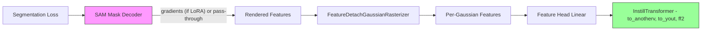

# Design Document: SAM C3G-F Integration

## Overview

This design integrates the Segment Anything Model (SAM) into the C3G-F feature distillation pipeline to enable multi-view consistent segmentation. The architecture leverages the existing `InstillTransformer` mechanism to cross-attend Gaussian tokens with SAM encoder features, renders 256-channel per-Gaussian features via differentiable splatting, and feeds those rendered features directly into SAM's mask decoder — bypassing the SAM encoder at inference time. A segmentation loss (BCE + dice) backpropagates through the mask decoder and rendering pipeline to fine-tune the C3G-F decoder. An optional LoRA adaptation on SAM's mask decoder addresses distribution shift between rendered Gaussian features and native SAM encoder outputs.

The key insight: SAM's encoder and decoder are designed as a pair. By distilling SAM encoder features into 3D Gaussians and then decoding the rendered features with SAM's mask decoder, we get multi-view consistent segmentation "for free" — the 3D Gaussian representation enforces consistency across viewpoints, while SAM's decoder handles mask prediction.

## Architecture

```mermaid
graph TD
    subgraph Training
        A[Multi-view Images] --> B[SAM Encoder - Frozen]
        B --> C[256×H/16×W/16 Features]
        C --> D[Interpolate to H/14×W/14]
        D --> E[InstillTransformer C3G-F Decoder]
        
        A --> F[VGGT Backbone]
        F --> G[Decoder Tokens]
        G --> E
        
        E --> H[Gaussian Tokens + Feature Tokens]
        H --> I[Feature Head → 256-dim per-Gaussian]
        I --> J[FeatureDetachGaussianRasterizer]
        J --> K[Rendered 256-ch Feature Map]
        
        K --> L[Interpolate to 64×64]
        L --> M[SAM Mask Decoder]
        M --> N[Predicted Masks]
        N --> O[BCE + Dice Loss]
        O --> |Gradients| E
        
        K --> P[Cosine Similarity Loss]
        C --> P
    end

    subgraph Inference
        Q[Novel Viewpoint] --> R[Render Gaussian Features]
        R --> S[256×64×64 Feature Map]
        S --> T[SAM Mask Decoder + Prompts]
        T --> U[Multi-view Consistent Masks]
    end
```



### Data Flow Summary

1. **SAM encoder** (frozen) extracts 256-channel features from input images
2. **InstillTransformer** cross-attends Gaussian tokens with SAM features using shared Q/K but separate value projections
3. **Feature head** projects decoded feature tokens to 256-dim per-Gaussian vectors
4. **Differentiable splatting** renders features into dense 2D feature maps
5. **SAM mask decoder** consumes rendered features + prompts → segmentation masks
6. **Segmentation loss** (BCE + dice) flows gradients back through steps 5→4→3→2

## Components and Interfaces

### 1. SAM Encoder Loading (`src/model/load_foundation_model.py`)

```python
def load_sam_encoder(model_variant: str, checkpoint_path: str) -> tuple[nn.Module, int]:
    """
    Load frozen SAM image encoder.
    
    Args:
        model_variant: One of 'sam_vit_h', 'sam_vit_l', 'sam_vit_b'
        checkpoint_path: Path to SAM checkpoint
    
    Returns:
        (sam_image_encoder, feature_dim=256)
    """
```

Integration point: Add `elif 'sam' in cfg.train.reproj_model:` branch in `load_foundation_model()`. Returns the SAM image encoder with all parameters frozen. The mask decoder and prompt encoder are loaded separately for the segmentation path.

### 2. SAM Feature Extraction (`src/model/model_wrapper.py`)

```python
def forward_foundation_model(self, input_image, interpolate=True):
    # ... existing branches ...
    elif 'sam' in self.train_cfg.reproj_model:
        # Resize to 1024×1024 (SAM's expected input)
        sam_input = F.interpolate(input_image.reshape(B*V, C, H, W), 
                                   size=(1024, 1024), mode='bilinear')
        # Run frozen SAM encoder
        with torch.no_grad():
            context_feature = self.sam_encoder(sam_input)  # (B*V, 256, 64, 64)
        context_feature = context_feature.reshape(B, V, 256, 64, 64)
```

The output is then interpolated to `(H//14, W//14)` to match the pipeline's standard feature grid (consistent with how DINOv2 features are handled).

### 3. InstillTransformer (existing, no changes needed)

The existing `InstillTransformer` in `src/model/encoder/common/gmae.py` already implements the required dual-stream attention:

- **Q, K** computed from the main token stream (shared attention map)
- **V** (main): applied to decoder tokens
- **V** (feature): `to_anotherv` projection applied to SAM features, producing feature tokens

The `to_anotherv` layer and `to_yout` projection remain trainable. When `gaussian_feature_dim: 256` is set, the feature head projects decoded feature tokens to 256-dim per-Gaussian vectors.

### 4. SAM Mask Decoder Wrapper (`src/model/sam_decoder.py` — new file)

```python
class SAMMaskDecoderWrapper(nn.Module):
    """
    Wraps SAM's mask decoder to accept rendered Gaussian features
    in place of native SAM encoder outputs.
    """
    def __init__(self, sam_checkpoint: str, model_variant: str, 
                 use_lora: bool = False, lora_rank: int = 4):
        # Load SAM mask decoder + prompt encoder
        # Optionally inject LoRA on v_proj layers
        
    def forward(self, rendered_features: Tensor, 
                point_coords: Tensor | None = None,
                point_labels: Tensor | None = None,
                box: Tensor | None = None) -> Tensor:
        """
        Args:
            rendered_features: (B, 256, H, W) from Gaussian splatting
            point_coords: (B, N, 2) point prompts
            point_labels: (B, N) point labels (1=foreground, 0=background)
            box: (B, 4) box prompts [x1, y1, x2, y2]
        
        Returns:
            masks: (B, num_masks, H_out, W_out) predicted masks
        """
        # Interpolate to 64×64 if needed
        # Generate positional encoding
        # Encode prompts (or use grid for segment-everything)
        # Run mask decoder
```

### 5. LoRA Adapter (`src/model/lora.py` — new file)

```python
class LoRALinear(nn.Module):
    """Low-rank adaptation for linear layers."""
    def __init__(self, original: nn.Linear, rank: int = 4):
        self.original = original  # frozen
        self.lora_A = nn.Linear(original.in_features, rank, bias=False)
        self.lora_B = nn.Linear(rank, original.out_features, bias=False)
        # B initialized to zero → initial output = original output
        
    def forward(self, x):
        return self.original(x) + self.lora_B(self.lora_A(x))
```

Applied to `v_proj` layers in SAM mask decoder's token-to-image cross-attention blocks. With rank=4 and typical SAM dimensions (256 internal), each LoRA adapter adds `256*4 + 4*256 = 2048` parameters. With 2 cross-attention layers, total is ~4K–8K trainable parameters.

### 6. Segmentation Loss (`src/loss/loss_segmentation.py` — new file)

```python
class SegmentationLoss(Loss):
    """BCE + Dice loss for SAM mask predictions."""
    
    def forward(self, prediction, batch, gaussians, global_step, target_image=None):
        # Get rendered features from prediction.feature
        # Run SAM mask decoder on rendered features
        # Compute BCE + dice against ground-truth masks
        # Return weighted loss
```

### 7. Configuration (`config/training/feature_head_sam.yaml`)

```yaml
train:
  reproj_model: sam
  feature_rendering_loss: 0.01
  segmentation_loss_weight: 1.0
  sam_model_variant: sam_vit_h
  sam_checkpoint: './pretrained_weights/sam_vit_h.pth'
  use_lora: false
  lora_rank: 4

model:
  encoder:
    gaussian_feature_dim: 256
  decoder:
    feature_detach: false  # Allow gradients through geometry
```

## Data Models

### Tensor Shapes Through the Pipeline

| Stage | Shape | Description |
|-------|-------|-------------|
| Input images | `(B, V, 3, H, W)` | Multi-view RGB images (typically 256×256) |
| SAM input | `(B*V, 3, 1024, 1024)` | Resized for SAM encoder |
| SAM encoder output | `(B*V, 256, 64, 64)` | Native SAM feature resolution |
| Pipeline features | `(B, V, 256, H//14, W//14)` | Interpolated to match DINOv2 grid |
| Gaussian features | `(B, num_gaussians, 256)` | Per-Gaussian feature vectors |
| Rendered features | `(B, V, 256, H, W)` | Splatted feature maps |
| Mask decoder input | `(B*V, 256, 64, 64)` | Interpolated for SAM decoder |
| Predicted masks | `(B*V, num_masks, 256, 256)` | Output segmentation masks |
| Ground-truth masks | `(B, V, H, W)` | Binary or multi-class labels |

### Configuration Dataclass Extension

```python
@dataclass
class TrainCfg:
    # ... existing fields ...
    segmentation_loss_weight: float = 0.0
    sam_model_variant: str = 'sam_vit_h'
    sam_checkpoint: str = ''
    use_lora: bool = False
    lora_rank: int = 4
```

### Gradient Flow Map



Green = always trainable. Pink = trainable only with LoRA enabled (otherwise frozen pass-through for gradients).

## Correctness Properties

*A property is a characteristic or behavior that should hold true across all valid executions of a system — essentially, a formal statement about what the system should do. Properties serve as the bridge between human-readable specifications and machine-verifiable correctness guarantees.*

### Property 1: Feature Extraction Shape Invariant

*For any* batch of images with arbitrary spatial dimensions (H, W) and arbitrary batch size B and view count V, the SAM feature extraction pipeline SHALL produce output features of shape `(B, V, 256, H//14, W//14)` after resizing to 1024×1024, encoding, and interpolating — matching the pipeline's standard feature grid.

**Validates: Requirements 1.1, 1.3**

### Property 2: InstillAttention Dual-Stream Output

*For any* input token sequence of length N and feature sequence of length M with matching batch dimensions, the InstillTransformer SHALL produce two output tensors: decoded tokens of shape `(B, N, transformer_dim)` and decoded feature tokens of shape `(B, N, feature_dim)`, where the feature tokens for the Gaussian token positions have dimension 256 after the feature head projection.

**Validates: Requirements 2.1, 2.3**

### Property 3: Segmentation Loss Correctness

*For any* predicted mask tensor and ground-truth mask tensor of matching spatial dimensions, the segmentation loss SHALL equal `weight * (BCE(pred, gt) + dice_loss(pred, gt))` where the weight is the configured `segmentation_loss_weight`, and the loss scales linearly with the weight parameter.

**Validates: Requirements 4.1, 4.2, 4.5**

### Property 4: Gradient Routing Correctness

*For any* forward pass through the full pipeline with LoRA disabled, after backpropagation of the segmentation loss, the C3G-F decoder's trainable parameters (`to_anotherv`, `to_yout`, `ff2`) SHALL have non-zero gradients, while all SAM mask decoder parameters SHALL have zero or None gradients.

**Validates: Requirements 4.3, 4.4**

### Property 5: Mask Decoder Accepts Rendered Features

*For any* rendered feature map of shape `(B, 256, H, W)` where H and W are arbitrary positive integers, and any valid set of point or box prompts, the SAM mask decoder wrapper SHALL interpolate features to 64×64, generate matching positional encodings, and produce valid mask outputs of shape `(B, num_masks, H_out, W_out)` without errors.

**Validates: Requirements 3.1, 3.3, 3.4**

### Property 6: LoRA Parameter Count

*For any* LoRA rank r applied to SAM mask decoder's token-to-image cross-attention v_proj layers with input dimension d_in and output dimension d_out, the total trainable parameter count SHALL equal `num_layers * 2 * r * max(d_in, d_out)` (approximately 4K–8K for rank 4 with SAM's 256-dim internal representation).

**Validates: Requirements 5.2**

### Property 7: Multi-View Feature Rendering Consistency

*For any* set of 3D Gaussians with feature vectors, rendering features from two different viewpoints and projecting the masks from one view to the other using known camera geometry SHALL produce an IoU above a minimum threshold for overlapping visible regions — demonstrating that the 3D representation enforces cross-view consistency.

**Validates: Requirements 7.1, 7.2**

### Property 8: Feature Rendering Differentiability

*For any* set of Gaussians with 256-dimensional feature vectors rendered through the `FeatureDetachGaussianRasterizer`, computing a scalar loss on the rendered feature map and calling backward SHALL produce non-zero gradients on the per-Gaussian feature vectors and, through the feature head, on the C3G-F decoder parameters.

**Validates: Requirements 8.1, 8.2**

## Error Handling

| Error Condition | Handling Strategy |
|----------------|-------------------|
| SAM checkpoint not found | Raise `FileNotFoundError` with clear message at model load time, before training starts |
| Input resolution not divisible by 16 | Pad input to nearest multiple of 16 before SAM encoder, crop features after |
| NaN/Inf in rendered features | Clamp to `[-1e4, 1e4]`, log warning with step number and view index, continue training |
| Ground-truth masks missing from batch | Skip segmentation loss for that batch, log info, compute only feature distillation loss |
| CUDA OOM during SAM encoder forward | SAM encoder runs in `torch.no_grad()` context; if OOM persists, reduce batch size via config |
| LoRA rank > min(d_in, d_out) | Clamp rank to `min(d_in, d_out)` and log warning |
| Mismatched mask/image spatial dimensions | Interpolate predicted masks to match ground-truth resolution before loss computation |
| SAM model variant not recognized | Raise `ValueError` listing supported variants at config validation time |

## Testing Strategy

### Unit Tests (Example-Based)

- **Config loading**: Verify `feature_head_sam.yaml` loads correctly with all required fields
- **SAM encoder freezing**: Verify all encoder parameters have `requires_grad=False`
- **LoRA injection**: Verify LoRA modules are correctly placed on v_proj layers when enabled
- **LoRA zero-init**: Verify matrix B is initialized to zeros (initial output = original)
- **Weight initialization from C3G-G**: Verify Q/K projections match source weights after init
- **Segment-everything mode**: Verify grid prompts are generated when no explicit prompts provided
- **Loss combination**: Verify both losses computed and combined when both enabled
- **feature_detach=False**: Verify gradients flow through both geometry and features

### Property-Based Tests

Property-based testing is appropriate for this feature because the core logic involves pure tensor transformations (reshaping, interpolation, attention computation, loss calculation) with clear input/output contracts that should hold across all valid inputs.

**Library**: [Hypothesis](https://hypothesis.readthedocs.io/) with `hypothesis[numpy]` for tensor generation

**Configuration**: Minimum 100 iterations per property test

Each property test references its design document property:

- **Feature: sam-c3g-f-integration, Property 1**: Feature extraction shape invariant
- **Feature: sam-c3g-f-integration, Property 2**: InstillAttention dual-stream output
- **Feature: sam-c3g-f-integration, Property 3**: Segmentation loss correctness
- **Feature: sam-c3g-f-integration, Property 4**: Gradient routing correctness
- **Feature: sam-c3g-f-integration, Property 5**: Mask decoder accepts rendered features
- **Feature: sam-c3g-f-integration, Property 6**: LoRA parameter count
- **Feature: sam-c3g-f-integration, Property 7**: Multi-view feature rendering consistency
- **Feature: sam-c3g-f-integration, Property 8**: Feature rendering differentiability

### Integration Tests

- **End-to-end training step**: Run one training step with SAM config, verify loss decreases
- **Multi-view consistency evaluation**: Render from 2 views, compute cross-view IoU
- **LoRA toggle**: Train with LoRA enabled/disabled, verify mask quality difference
- **Combined loss training**: Verify both feature distillation and segmentation losses contribute

### Test Priorities

1. Properties 3, 4 (loss and gradient correctness) — critical for training to work
2. Properties 1, 2 (shape invariants) — catch integration bugs early
3. Property 8 (differentiability) — ensures the training signal reaches the decoder
4. Properties 5, 6 (mask decoder, LoRA) — functional correctness of new components
5. Property 7 (multi-view consistency) — validates the core research hypothesis
